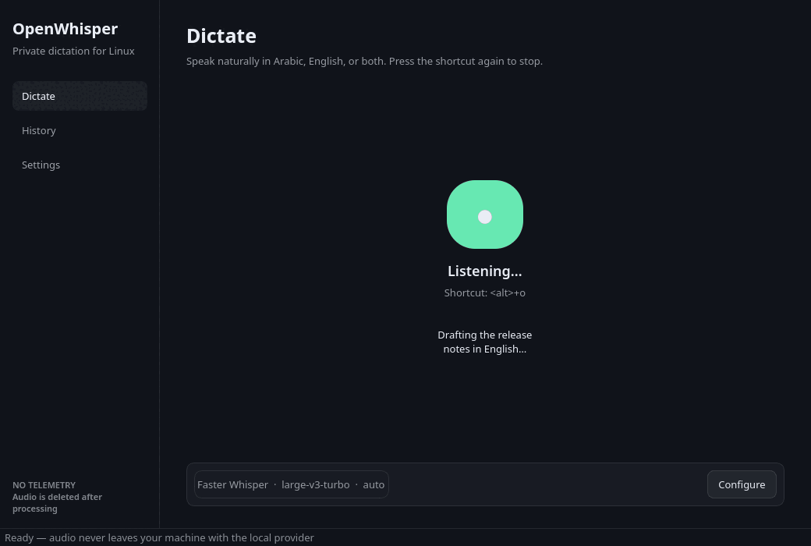
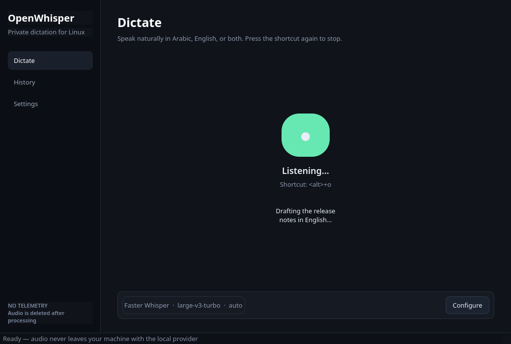
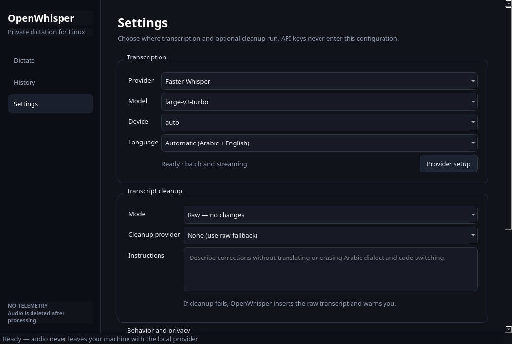

# OpenWhisper

OpenWhisper is a privacy-first Linux desktop dictation app for Arabic, English,
and natural Arabic-English code-switching. It runs transcription locally by
default with Faster Whisper, and lets you bring your own keys for supported
cloud providers when that is a better fit.

OpenWhisper v0.1 targets Linux x86_64, Python 3.12, and PySide6. It is an alpha
release: use it for personal workflows and report problems with enough detail
to reproduce them. [النسخة العربية](README.ar.md)



<p align="center">
  
  
</p>

## What it does

- Records through Qt Multimedia/PipeWire or PulseAudio, then transcribes and inserts the result.
- Supports toggle and push-to-talk shortcuts, with portal-first binding and an
  X11 fallback.
- Keeps Faster Whisper local by default; model weights download only when a
  selected local model is first used.
- Offers optional Cohere, OpenAI, Groq, and Deepgram transcription adapters,
  plus optional cleanup with supported providers.
- Preserves the raw transcript by default. Raw, Clean, Formal/MSA, Message,
  Email, Note, Smart, and Custom modes each own their context consent and rules.
- Adds recognition vocabulary, voice snippets, deterministic Arabic/English
  formatting, selected-text transform previews, guarded undo, and Command Mode.
- Stores raw/final text and non-sensitive performance metadata in searchable
  local history. Audio retention is off by default; if enabled it defaults to
  seven days and is capped at thirty.
- Types directly on X11 where supported. On Wayland, it uses an available
  insertion method or copies the result to the clipboard and tells you.
- Uses the XDG Secret portal for encrypted API-key storage when available; no
  keys are written to the INI configuration, transcript history, or logs.

OpenWhisper does not provide hosted accounts, synchronization, or telemetry.

## Install (Flatpak)

OpenWhisper ships as a signed x86_64 Flatpak only. The `beta` remote receives
new builds from `main`; `stable` is promoted from an approved version tag after
the Linux acceptance gates pass.

```bash
flatpak remote-add --if-not-exists --from openwhisper \
  https://yousufaltayeb.github.io/openwhisper/openwhisper-beta.flatpakrepo
flatpak install openwhisper io.github.yousufaltayeb.OpenWhisper//beta
flatpak run io.github.yousufaltayeb.OpenWhisper
```

For a stable release, replace `openwhisper-beta.flatpakrepo` and `//beta` with
`openwhisper-stable.flatpakrepo` and `//stable`. The remote embeds the release
public key; Flatpak verifies repository signatures before installing or
updating. Flathub is intentionally not used under its current
[generative-AI submission policy](https://docs.flathub.org/docs/for-app-authors/requirements#generative-ai-policy).

Release signing fingerprint:
`9DFE F9AB 055B 9CC8 A4D1 6DBB B6BF 3FE6 2C7E 797D`.

### Manual development install

For a source checkout, use uv and Python 3.12:

```bash
uv python install 3.12
uv sync --extra dev
uv run openwhisper
```

Source development uses the host Qt Multimedia stack. Global shortcuts and
direct insertion remain desktop-dependent; X11 has a fallback, while Wayland
uses the Global Shortcuts portal where the compositor provides it.

## First run and storage

| Data | Location | Notes |
| --- | --- | --- |
| Preferences | Flatpak config directory | No credentials are stored here. |
| History | Flatpak data directory | Raw and final text remain local. |
| Temporary audio | Flatpak cache directory | Removed after processing and stale files are cleaned at startup. |
| Retained audio | Flatpak data directory | Off by default; opt-in only, 7-day default and 30-day maximum. |
| API keys | XDG Secret portal encrypted envelope | Environment variables and session memory are fallbacks. |

If `~/.config/whisper/config.ini` exists and OpenWhisper has not yet created a
configuration, OpenWhisper migrates compatible preferences once through a
narrow read-only Flatpak mount. It never deletes or edits the old configuration.

## Configuration

The application settings screen is the recommended way to configure providers,
models, cleanup, and shortcuts. For source development, start with
[config.example.ini](config.example.ini).

Important defaults:

- `provider = faster-whisper` and `model = large-v3-turbo` use the local
  backend. Choose `cpu` or `cuda` instead of `auto` when you need to force a
  device.
- `language = auto` allows Arabic and English. Choose `ar`, `ar-SA`, or `en`
  if a provider or workflow needs an explicit language.
- `mode = raw` in `[cleanup]` leaves the transcript unchanged.
- `mode = toggle` in `[shortcuts]` starts on the first press and stops on the
  second. Use `push-to-talk` to hold the shortcut while speaking.
- `retention_days = 0` removes retained text on the next history-pruning pass.
- `retain = false` in `[audio]` keeps recordings ephemeral. Enabling it uses
  `retention_days = 7`; values above thirty are rejected.
- Every context source is disabled per mode until explicitly selected. Cloud
  context also requires the separate cloud-context consent toggle.

Never put an API key in this file, a shell history, or a bug report. Configure
keys in **Settings → Provider setup**, or set the provider's conventional
environment variable before starting the app: `COHERE_API_KEY`,
`OPENAI_API_KEY`, `GROQ_API_KEY`, or `DEEPGRAM_API_KEY`.

## Providers

| Provider | Role | Install |
| --- | --- | --- |
| Faster Whisper | Default local transcription | Included in the Flatpak |
| Cohere Transcribe Arabic local | Optional signed Flatpak runtime extension | Install from the OpenWhisper remote |
| Cohere | BYOK cloud transcription and optional cleanup | Built in; add a key |
| OpenAI | BYOK cloud transcription and optional cleanup | Built in; add a key |
| Groq | BYOK cloud transcription and optional cleanup | Built in; add a key |
| Deepgram Nova | BYOK cloud transcription | Built in; add a key |
| Qwen3 4B GGUF Q4_K_M | Optional local editing/cleanup | CPU `llama-server` included; weights download on demand |

CPU is the supported path. Source-development builds of `llama-server` with a
GPU backend may opt into experimental offload with
`OPENWHISPER_EXPERIMENTAL_LOCAL_GPU=1`; startup automatically retries on CPU if
that backend fails.

Cloud audio is sent to the provider you select; read that provider's data policy
before use. The local Faster Whisper path does not send recording audio to a
cloud transcription provider.

For the optional local Cohere Arabic backend, first accept the gated model
terms on [Hugging Face](https://huggingface.co/CohereLabs/cohere-transcribe-arabic-07-2026),
install the optional runtime extension from the OpenWhisper remote, then open
**Settings → Provider setup → Install managed pack**. OpenWhisper checks for a
supported GPU or at least 8 GiB of system memory and requires an explicit `ar`
or `en` language selection. A token entered for the download is passed directly
to Hugging Face and is not stored by OpenWhisper. In source-development runs,
an existing Hugging Face CLI login can also be used.

```bash
flatpak install openwhisper \
  io.github.yousufaltayeb.OpenWhisper.CohereLocal//beta
```

Use `//stable` when the application itself is installed from the stable branch.

## Desktop behavior

Application ID: `io.github.yousufaltayeb.OpenWhisper`; source CLI:
`openwhisper`. The Flatpak launcher is installed as
`io.github.yousufaltayeb.OpenWhisper.desktop`.

The Flatpak requests only network, mediated microphone, Wayland/fallback X11,
DRI, accessibility-bus, StatusNotifier, Secret-portal, and read-only legacy
config access. It does not request host filesystems or broad system/session bus
access. On first run, diagnostics identify microphone, shortcut, insertion,
credential portal, local runtime, and storage readiness without recording or
sending audio.

## Development

See [CONTRIBUTING.md](CONTRIBUTING.md) for setup, checks, and pull-request
expectations. The planned scope and release gates live in
[docs/ROADMAP.md](docs/ROADMAP.md) and [docs/RELEASE_CHECKLIST.md](docs/RELEASE_CHECKLIST.md).

## License and notices

OpenWhisper is MIT-licensed. It began from Soupawhisper; releases must preserve
the upstream notices and include the notices for bundled runtime dependencies.
See [LICENSE](LICENSE) and [NOTICE.md](NOTICE.md).
